## Actual - AI Powered Personal Finance Analytics 💰

Actual is an AI-powered personal finance analytics platform that helps users track expenses, manage budgets, analyze spending habits, and receive intelligent financial insights for better money decisions.

## 🚀 Live Demo

> **Please try the demo first.**

<p>
  <a href="https://actual.debarghya.org/demo"></a> 👈 Click Here
</p>


🌐 https://actual.debarghya.org

## 🎯 Motivation

This project was inspired by my diploma college life, when I moved away from home and struggled to manage daily expenses like food, rent, travel, bills, fees, and emergencies. Even with monthly support from my family, it was difficult to understand where the money was going.

I realized many students face the same problem because they lack simple tools for budgeting, expense tracking, and financial planning. Actual was built to solve this by helping users track expenses, analyze spending habits, manage budgets, and get AI-powered financial insights for better daily money decisions.

## ✨ Features

- 🔐 Secure authentication with Clerk
- 📊 Personal finance dashboard
- 🏦 Account management with default account support
- 💸 Income and expense tracking
- 🧾 AI receipt scanning
- 🔁 Recurring transaction support
- 🎯 Budget planning and category targets
- 📈 Analytics, reports, and financial health score
- 🤖 AI finance assistant, Kubera
- 📧 Budget alerts and monthly report emails
- 🧪 Demo mode for quick exploration

## 🏗️ Architecture

### 1. 3-Tier Client-Server Architecture

Actual supports two user flows: **Demo Mode** for quick exploration and **Authenticated Mode** for real personal finance management.

```text
DEMO MODE

User
  ↓
Next.js Demo Pages
  ↓
Demo Dashboard UI
  ↓
Static / Sample Finance Data
  ↓
Charts, Reports, Budgets, AI Preview
```

```text
AUTHENTICATED MODE

User
  ↓
Clerk Login / Sign Up
  ↓
Protected Next.js Dashboard
  ↓
Server Actions / API Routes
  ↓
Prisma ORM
  ↓
PostgreSQL Database
```

- **Client Layer:** Next.js pages and React components render the landing page, demo dashboard, authenticated dashboard, forms, charts, reports, and AI workspace.
- **Server Layer:** Server Actions, API routes, Clerk authentication, Arcjet rate limiting, and Inngest background jobs handle secure business logic.
- **Database Layer:** PostgreSQL stores real user data such as accounts, transactions, budgets, and dashboard preferences through Prisma ORM.

### 2. Workflow Diagram

#### Demo Login / Try Demo Flow

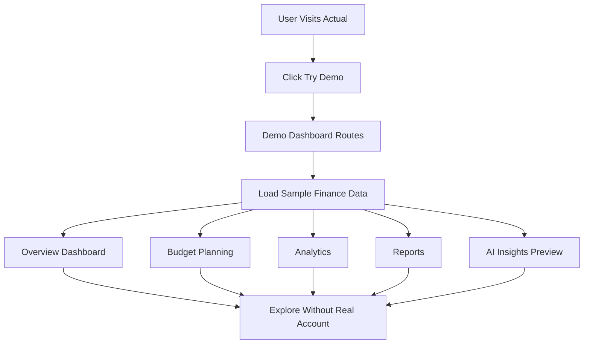

#### Authenticated Login Flow

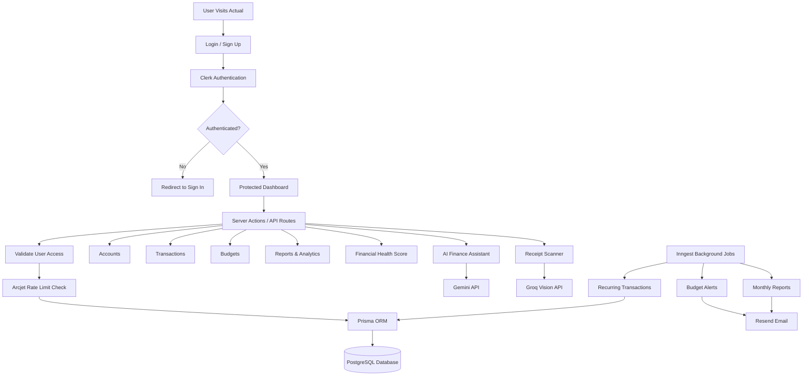

## 📁 Folder Structure

```text
actual/
├── app/                  # Next.js App Router pages, layouts, API routes, and server actions
│   ├── (auth)/           # Clerk sign-in and sign-up routes
│   ├── (main)/           # Protected dashboard, account, transaction, budget, reports, analytics pages
│   ├── actions/          # Server Actions for accounts, transactions, budgets, AI, and emails
│   ├── api/              # API routes for Inngest, seed, and financial health
│   └── demo/             # Demo mode pages
├── components/           # Shared React components and dashboard UI
│   └── ui/               # Reusable UI components
├── data/                 # Categories and landing page data
├── emails/               # React email templates
├── hooks/                # Custom React hooks
├── lib/                  # Prisma, auth helpers, Arcjet, Inngest, utilities, demo data
├── prisma/               # Prisma schema and database migrations
├── public/               # Logos, screenshots, and feature images
├── proxy.ts              # Clerk route protection and request proxy
├── next.config.ts        # Next.js configuration
└── package.json          # Scripts and dependencies
```

## 🗄️ Database Design

### 1. Database Schema / Entity Relationship Diagram (ERD)

The database uses PostgreSQL with Prisma ORM. The main entities are `User`, `Account`, `Transaction`, `Budget`, and `DashboardPreferences`.

| Table / Model | Purpose | Main Fields |
| --- | --- | --- |
| `User` | Stores authenticated user details from Clerk | `id`, `clerkUserId`, `email`, `name`, `imageUrl` |
| `Account` | Stores user bank/cash accounts | `id`, `name`, `type`, `balance`, `isDefault`, `userId` |
| `Transaction` | Stores income and expense records | `id`, `type`, `amount`, `date`, `category`, `accountId`, `userId` |
| `Budget` | Stores monthly budget information | `id`, `amount`, `lastAlertSent`, `userId` |
| `DashboardPreferences` | Stores dashboard and budget planning preferences | `userId`, `monthlyBudgetTargets`, `savingsGoalTargets`, `categoryTargetsByMonth` |

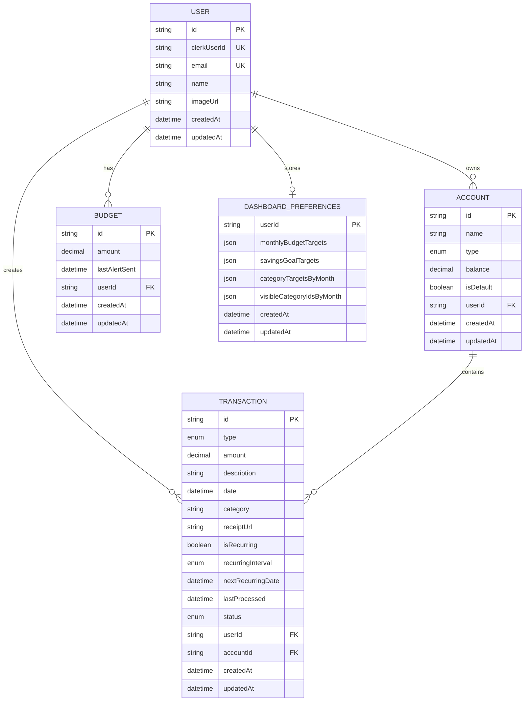

## 🖼️ Screenshots

### Landing Page

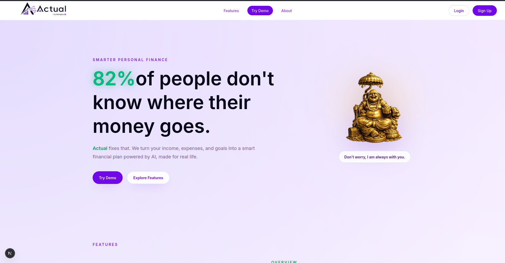

### Overview

| Dashboard | Account Summary |
| --- | --- |
|  | 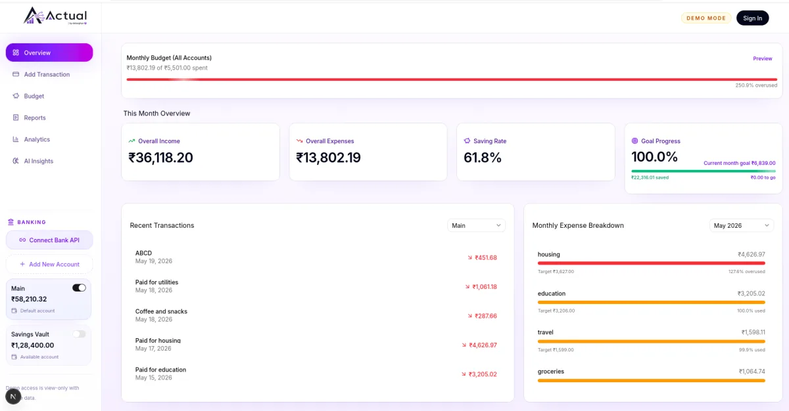 |

### Transactions

| Transaction List | Create Transaction |
| --- | --- |
| 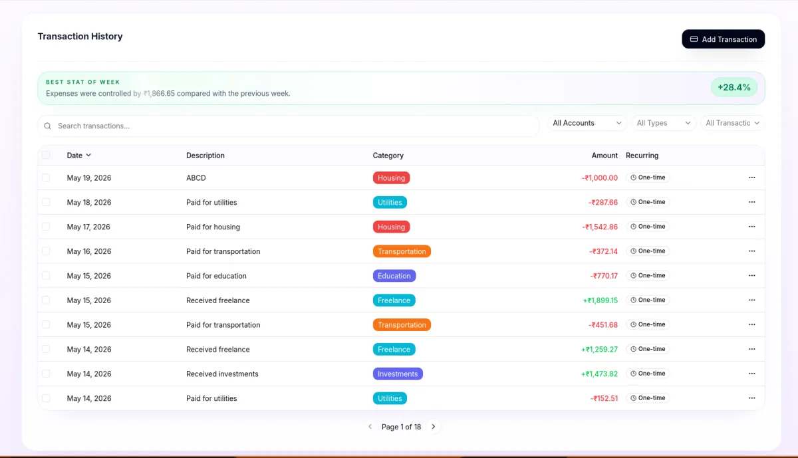 |  |

| Transaction Form |
| --- |
| 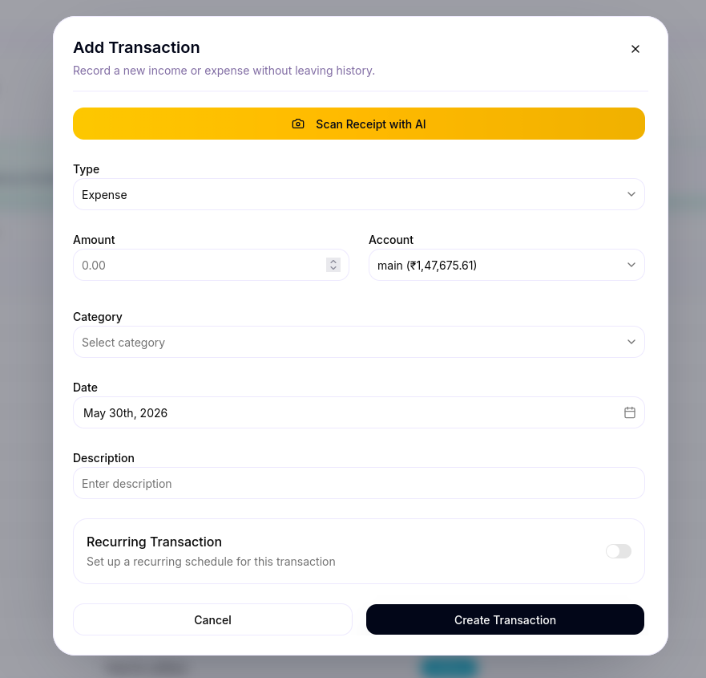 |

### Budgets

| Budget Planning | Category Targets |
| --- | --- |
| 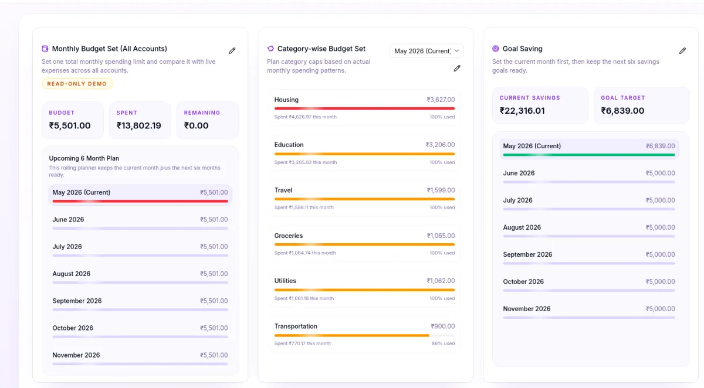 | 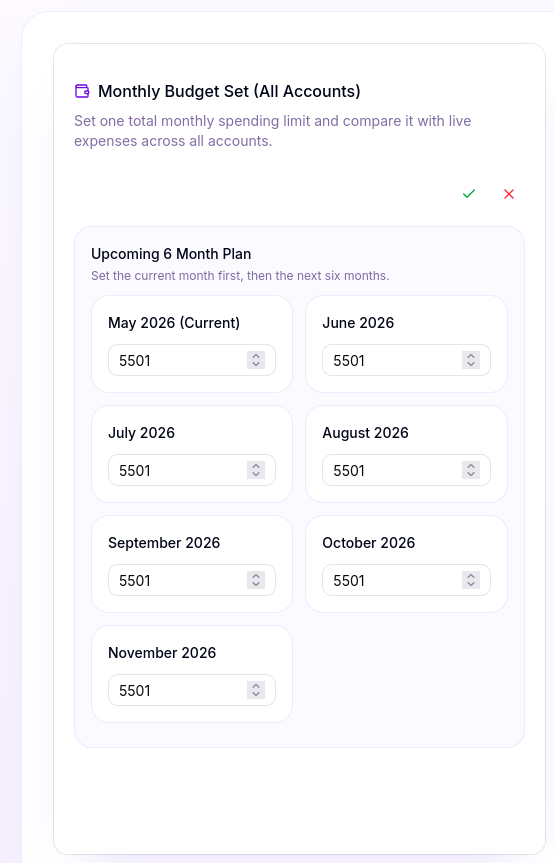 |

| Budget Alert Email |
| --- |
| 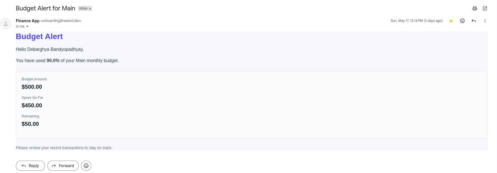 |

### Reports & Analytics

| Reports | Analytics |
| --- | --- |
| 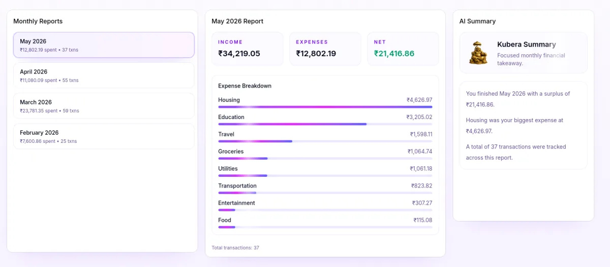 | 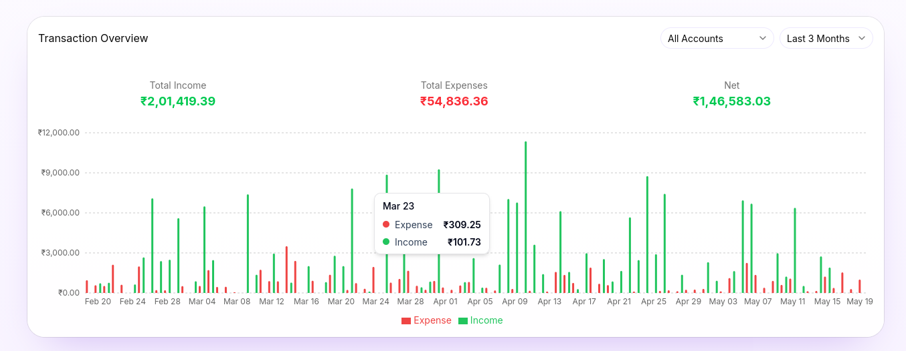 |

| Monthly Report Email |
| --- |
| 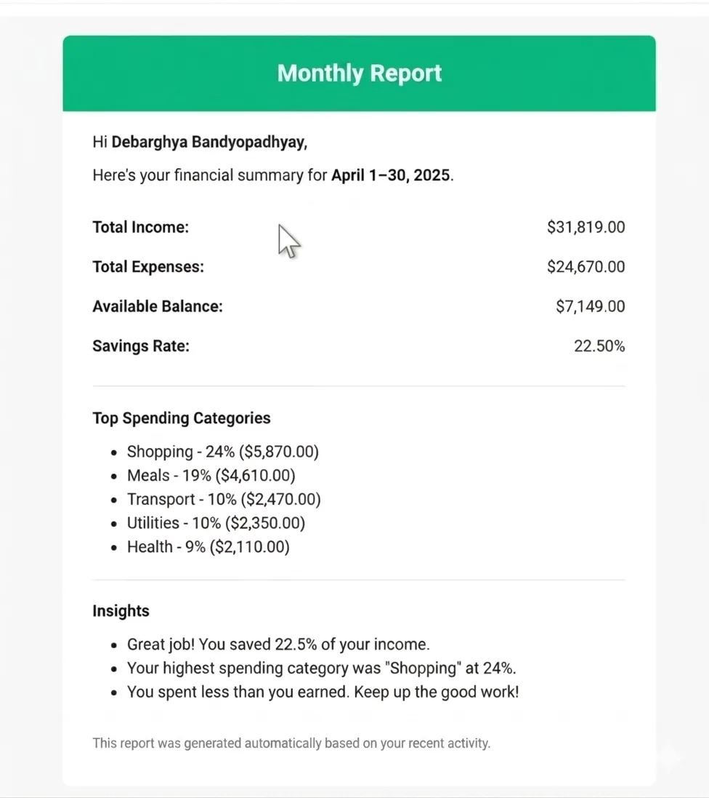 |

### AI Insights

| Kubera AI Assistant | AI Insights |
| --- | --- |
| 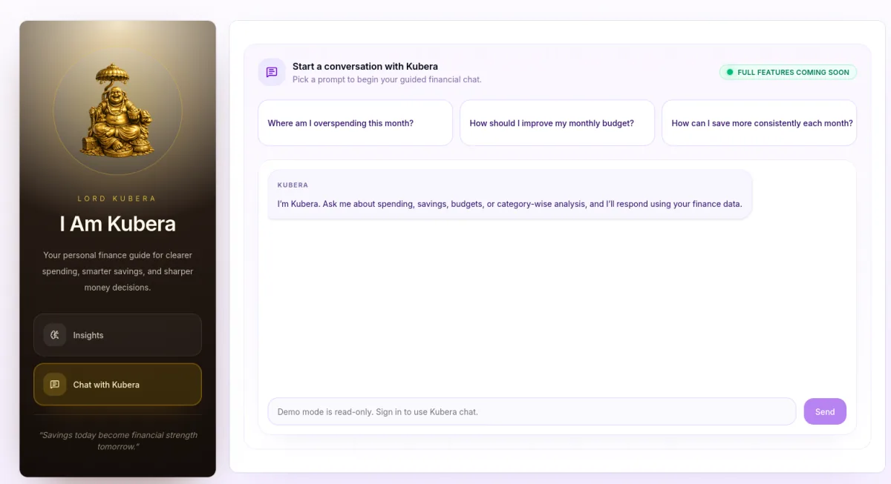 | 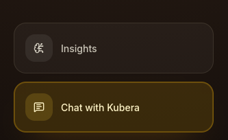 |

## 🛠️ Tech Stack

| Category | Technologies |
| --- | --- |
| Frontend | Next.js, React, TypeScript |
| Styling | Tailwind CSS, shadcn-style UI, Radix UI |
| Authentication | Clerk |
| Database | PostgreSQL, Prisma ORM |
| Background Jobs | Inngest |
| AI / ML | Google Gemini API, Groq Vision API |
| Email | Resend, React Email |
| Charts & Analytics | Recharts |
| Animations | Framer Motion |
| Security | Arcjet rate limiting |
| Icons & UI Feedback | lucide-react, Sonner |

## ⚙️ Installation

1. Clone the repository.

```bash
git clone https://github.com/debarghya131/Actual.git
cd Actual
```

2. Install dependencies.

```bash
npm install
```

3. Set up environment variables.

```bash
cp .env.example .env.local
```

4. Generate Prisma client.

```bash
npx prisma generate
```

5. Run database migrations.

```bash
npx prisma migrate dev
```

6. Start the development server.

```bash
npm run dev
```

## 🔐 Environment Variables

Create a `.env.local` file in the root directory and add the following variables:

```env
DATABASE_URL=
DIRECT_URL=

NEXT_PUBLIC_CLERK_PUBLISHABLE_KEY=
CLERK_SECRET_KEY=
NEXT_PUBLIC_CLERK_SIGN_IN_URL=/sign-in
NEXT_PUBLIC_CLERK_SIGN_UP_URL=/sign-up

ARCJET_KEY=

RESEND_API_KEY=

GEMINI_API_KEY=

GROQ_API_KEY=
GROQ_MODEL=
```

> Never commit real API keys or database credentials to GitHub.

## 🧩 Challenges Faced

- Managing student-style daily expenses in a simple and understandable way
- Keeping account balances accurate after transaction create, update, and delete actions
- Handling recurring transactions without duplicate processing
- Building a useful budget system with monthly and category-wise planning
- Extracting receipt details from images using AI
- Giving personalized AI finance insights without exposing user data publicly
- Protecting authenticated dashboard routes and user-specific data
- Preventing abuse of AI, receipt scanning, and transaction actions
- Sending useful budget alerts and monthly reports automatically
- Keeping the landing page and dashboard visually rich but still lightweight

## ✅ Solutions Implemented

- Built a clean dashboard for income, expenses, savings, budgets, reports, and analytics
- Used Prisma transactions to update transactions and account balances safely
- Added Inngest background jobs for recurring transactions, budget alerts, and monthly reports
- Used Groq Vision API for AI-powered receipt scanning
- Used Gemini API for Kubera AI finance guidance and monthly insights
- Added Clerk authentication and protected routes through `proxy.ts`
- Applied Arcjet rate limiting for sensitive actions like AI chat, receipt scan, account creation, and budget updates
- Stored dashboard preferences in PostgreSQL using Prisma and JSON fields
- Added demo mode so users can explore the app without creating an account
- Compressed large images and replaced heavy PNG assets with optimized WebP files

## 🧪 Testing

- ESLint is configured for code quality checks.
- Server Actions include validation for authentication, required fields, invalid amounts, missing accounts, and invalid recurring transaction data.
- Receipt scanning validates file type and file size before sending images to the AI service.
- Demo mode helps test the main dashboard experience without using real user data.
- Prisma migrations keep the database structure version-controlled and reproducible.

Run linting with:

```bash
npm run lint
```

## ⚡ Optimization

- Large images were compressed and replaced with lightweight WebP assets.
- Heavy dashboard sections use focused components to keep the UI organized.
- Prisma indexes are added for frequently queried fields like `userId`, `accountId`, transaction status, date, and recurring transaction data.
- Server-side data fetching is used for authenticated dashboard pages.
- `Promise.all` is used where multiple independent database queries can run together.
- Prisma client is reused in development to avoid creating too many database connections.
- Background work like recurring transactions, budget alerts, and monthly reports is handled by Inngest instead of blocking user interactions.

## 🔒 Security

- Clerk handles authentication and user session management.
- Protected routes are guarded through `proxy.ts`.
- Database queries are filtered by the authenticated user to prevent cross-user data access.
- Arcjet rate limiting protects sensitive actions such as AI chat, receipt scanning, account creation, transaction creation, and budget updates.
- Environment variables store API keys and database credentials outside the codebase.
- `.env*`, generated files, local tool folders, and build outputs are ignored by Git.
- Receipt uploads are restricted to image files under 5MB.
- Server-side validation is used before creating or updating financial records.

## 🚀 Future Improvements

- Add bank API integration for automatic transaction syncing
- Add CSV import and export for transactions
- Add more advanced AI-based spending predictions
- Add multi-currency support
- Add custom financial goals and goal progress tracking
- Add downloadable PDF reports
- Add more automated tests for Server Actions and financial calculations
- Add PWA support for a better mobile experience
- Add dark mode for the full dashboard
- Add more detailed admin and user activity logs

## 📚 Learnings

- Learned how to build a full-stack finance dashboard with Next.js App Router
- Learned how to design relational database models with Prisma and PostgreSQL
- Learned how to protect user-specific financial data with authentication and server-side checks
- Learned how to manage financial calculations like balances, budgets, savings, and recurring transactions
- Learned how to integrate AI APIs for receipt scanning and finance insights
- Learned how to use background jobs for scheduled reports and alerts
- Learned how to optimize large assets for faster landing page performance
- Learned how to structure a real-world project with reusable components, server actions, and clean folder organization

## 👨‍💻 Author Details

**Debarghya Bandyopadhyay**

## 🤝 Be My Friend

I always like to make new friends. Follow me on:


[](https://www.linkedin.com/in/debarghya-bandyopadhyay-953b02400?utm_source=share_via&utm_content=profile&utm_medium=member_android)


[](https://x.com/debarghya131)


[](https://github.com/debarghya131)


[](https://portfolio.debarghya.org)


[](mailto:debarghyabandyopadhyay191@gmail.com)
