## Actual - AI Powered Personal Finance Analytics 💰

Actual is an AI-powered personal finance analytics platform that helps users track expenses, manage budgets, analyze spending habits, and receive intelligent financial insights for better money decisions.

## 🚀 Live Demo

> **Please try the demo first.**

<p>
  <a href="https://actual.debarghya.org/demo"></a> 👈 Click Here
</p>


🌐 https://actual.debarghya.org

## 🎯 Motivation

This project was inspired by my diploma college life, when I moved away from home and struggled to manage daily expenses like food, rent, travel, bills, fees, and emergencies. Even with monthly support from my family, it was difficult to understand where the money was going.

I realized many students face the same problem because they lack simple tools for budgeting, expense tracking, and financial planning. Actual was built to solve this by helping users track expenses, analyze spending habits, manage budgets, and get AI-powered financial insights for better daily money decisions.

## ✨ Features

- 🔐 Secure authentication with Clerk
- 📊 Personal finance dashboard
- 🏦 Account management with default account support
- 💸 Income and expense tracking
- 🧾 AI receipt scanning
- 🔁 Recurring transaction support
- 🎯 Budget planning and category targets
- 📈 Analytics, reports, and financial health score
- 🤖 AI finance assistant, Kubera
- 📧 Budget alerts and monthly report emails
- 🧪 Demo mode for quick exploration

## 🏗️ Architecture

### 1. 3-Tier Client-Server Architecture

Actual uses an authenticated client-server flow for personal finance management.

```text
AUTHENTICATED MODE

User
  ↓
Clerk Login / Sign Up
  ↓
Protected Next.js Dashboard
  ↓
Server Actions / API Routes
  ↓
Prisma ORM
  ↓
PostgreSQL Database
```

- **Client Layer:** Next.js pages and React components render the landing page, demo dashboard, authenticated dashboard, forms, charts, reports, and AI workspace.
- **Server Layer:** Server Actions, API routes, Clerk authentication, Arcjet rate limiting, and Inngest background jobs handle secure business logic.
- **Database Layer:** PostgreSQL stores real user data such as accounts, transactions, budgets, and dashboard preferences through Prisma ORM.

### 2. System Workflow Diagram

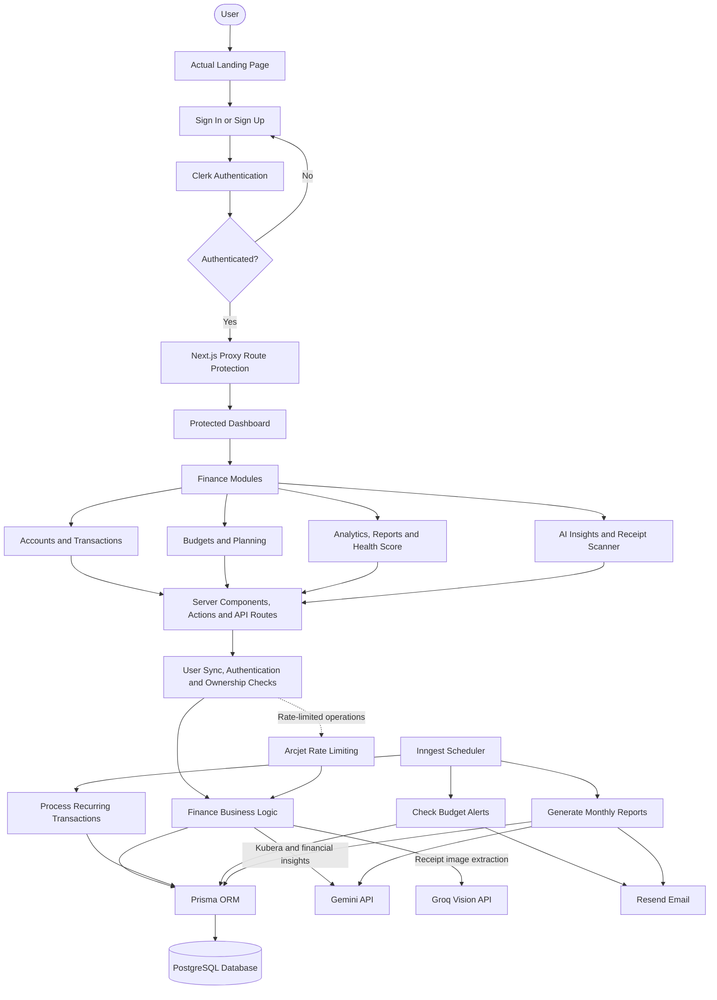
```mermaid
flowchart TB
    USER([User]) --> LANDING[Actual Landing Page]
    LANDING --> LOGIN[Sign In or Sign Up]
    LOGIN --> CLERK[Clerk Authentication]
    CLERK --> ACCESS{Authenticated?}
    ACCESS -->|No| LOGIN
    ACCESS -->|Yes| PROXY[Next.js Proxy Route Protection]
    PROXY --> DASHBOARD[Protected Dashboard]

    DASHBOARD --> MODULES[Finance Modules]
    MODULES --> ACCOUNTS[Accounts and Transactions]
    MODULES --> BUDGETS[Budgets and Planning]
    MODULES --> ANALYTICS[Analytics, Reports and Health Score]
    MODULES --> AI[AI Insights and Receipt Scanner]

    ACCOUNTS --> SERVER[Server Components, Actions and API Routes]
    BUDGETS --> SERVER
    ANALYTICS --> SERVER
    AI --> SERVER

    SERVER --> AUTHZ[User Sync, Authentication and Ownership Checks]
    AUTHZ --> LOGIC[Finance Business Logic]
    AUTHZ -. Rate-limited operations .-> ARCJET[Arcjet Rate Limiting]
    ARCJET --> LOGIC

    LOGIC --> PRISMA[Prisma ORM]
    PRISMA --> DATABASE[(PostgreSQL Database)]

    LOGIC -->|Kubera and financial insights| GEMINI[Gemini API]
    LOGIC -->|Receipt image extraction| GROQ[Groq Vision API]

    INNGEST[Inngest Scheduler] --> RECURRING[Process Recurring Transactions]
    INNGEST --> ALERTS[Check Budget Alerts]
    INNGEST --> REPORTS[Generate Monthly Reports]

    RECURRING --> PRISMA
    ALERTS --> PRISMA
    REPORTS --> PRISMA
    REPORTS --> GEMINI
    ALERTS --> RESEND[Resend Email]
    REPORTS --> RESEND
```

### 3. Data Flow Diagram (DFD)

The context diagram shows the system boundary and the external services that exchange data with Actual.

#### Level 0 — System Context

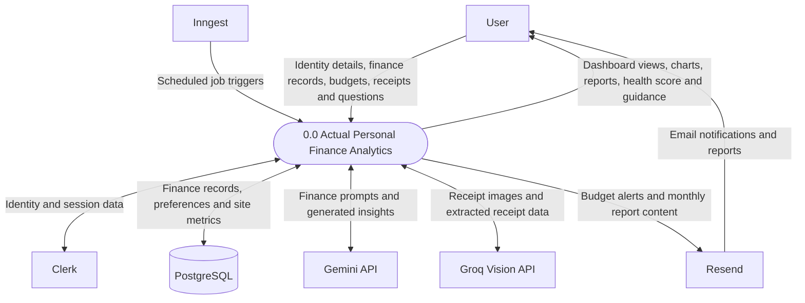
```mermaid
flowchart TB
    USER[User] -->|Identity details, finance records, budgets, receipts and questions| SYSTEM([0.0 Actual Personal Finance Analytics])
    SYSTEM -->|Dashboard views, charts, reports, health score and guidance| USER

    SYSTEM <-->|Identity and session data| CLERK[Clerk]
    SYSTEM <-->|Finance records, preferences and site metrics| DATABASE[(PostgreSQL)]
    SYSTEM <-->|Finance prompts and generated insights| GEMINI[Gemini API]
    SYSTEM <-->|Receipt images and extracted receipt data| GROQ[Groq Vision API]

    INNGEST[Inngest] -->|Scheduled job triggers| SYSTEM
    SYSTEM -->|Budget alerts and monthly report content| RESEND[Resend]
    RESEND -->|Email notifications and reports| USER
```

The detailed diagrams separate user-driven activity from scheduled automation so each data path remains readable.

#### Level 1A — Interactive Application Data Flow

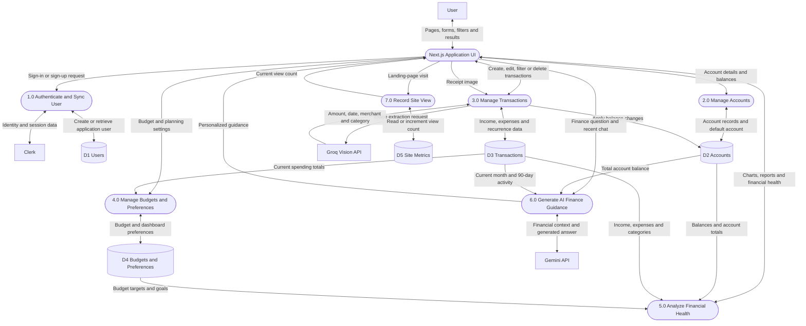
```mermaid
flowchart TB
    USER[User] <-->|Pages, forms, filters and results| UI([Next.js Application UI])

    UI -->|Sign-in or sign-up request| AUTH([1.0 Authenticate and Sync User])
    AUTH <-->|Identity and session data| CLERK[Clerk]
    AUTH <-->|Create or retrieve application user| D1[(D1 Users)]

    UI <-->|Account details and balances| ACCOUNT([2.0 Manage Accounts])
    ACCOUNT <-->|Account records and default account| D2[(D2 Accounts)]

    UI <-->|Create, edit, filter or delete transactions| TRANSACTION([3.0 Manage Transactions])
    TRANSACTION <-->|Income, expenses and recurrence data| D3[(D3 Transactions)]
    TRANSACTION -->|Apply balance changes| D2
    UI -->|Receipt image| TRANSACTION
    TRANSACTION -->|Image extraction request| GROQ[Groq Vision API]
    GROQ -->|Amount, date, merchant and category| TRANSACTION

    UI <-->|Budget and planning settings| BUDGET([4.0 Manage Budgets and Preferences])
    BUDGET <-->|Budget and dashboard preferences| D4[(D4 Budgets and Preferences)]
    D3 -->|Current spending totals| BUDGET

    UI <-->|Charts, reports and financial health| ANALYTICS([5.0 Analyze Financial Health])
    D2 -->|Balances and account totals| ANALYTICS
    D3 -->|Income, expenses and categories| ANALYTICS
    D4 -->|Budget targets and goals| ANALYTICS

    UI -->|Finance question and recent chat| KUBERA([6.0 Generate AI Finance Guidance])
    D2 -->|Total account balance| KUBERA
    D3 -->|Current month and 90-day activity| KUBERA
    KUBERA <-->|Financial context and generated answer| GEMINI[Gemini API]
    KUBERA -->|Personalized guidance| UI

    UI -->|Landing-page visit| METRICS([7.0 Record Site View])
    METRICS <-->|Read or increment view count| D5[(D5 Site Metrics)]
    METRICS -->|Current view count| UI
```

#### Level 1B — Background Automation Data Flow

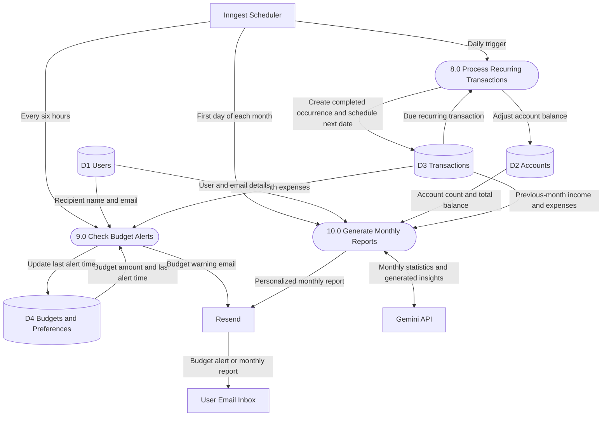
```mermaid
flowchart TB
    INNGEST[Inngest Scheduler] -->|Daily trigger| RECURRING([8.0 Process Recurring Transactions])
    D3[(D3 Transactions)] -->|Due recurring transaction| RECURRING
    RECURRING -->|Create completed occurrence and schedule next date| D3
    RECURRING -->|Adjust account balance| D2[(D2 Accounts)]

    INNGEST -->|Every six hours| ALERTS([9.0 Check Budget Alerts])
    D1[(D1 Users)] -->|Recipient name and email| ALERTS
    D3 -->|Current-month expenses| ALERTS
    D4[(D4 Budgets and Preferences)] -->|Budget amount and last alert time| ALERTS
    ALERTS -->|Update last alert time| D4
    ALERTS -->|Budget warning email| RESEND[Resend]

    INNGEST -->|First day of each month| REPORTS([10.0 Generate Monthly Reports])
    D1 -->|User and email details| REPORTS
    D2 -->|Account count and total balance| REPORTS
    D3 -->|Previous-month income and expenses| REPORTS
    REPORTS <-->|Monthly statistics and generated insights| GEMINI[Gemini API]
    REPORTS -->|Personalized monthly report| RESEND

    RESEND -->|Budget alert or monthly report| USER[User Email Inbox]
```

| Data store | Information stored |
| --- | --- |
| `D1 Users` | Clerk user ID, email, name, and profile image |
| `D2 Accounts` | Account name, type, balance, and default-account state |
| `D3 Transactions` | Income, expenses, categories, dates, status, and recurring schedules |
| `D4 Budgets and Preferences` | Monthly budget, savings goals, category targets, and dashboard visibility settings |
| `D5 Site Metrics` | Persistent landing-page view count |

All authenticated finance processes validate the Clerk user and data ownership before accessing PostgreSQL. Arcjet rate limits sensitive operations such as account creation, transaction creation, budget updates, receipt scanning, and Kubera requests.

## 📁 Folder Structure

```text
actual/
├── app/                              # Next.js App Router application
│   ├── (auth)/                       # Clerk authentication route group
│   │   ├── sign-in/[[...sign-in]]/   # Sign-in page
│   │   └── sign-up/[[...sign-up]]/   # Sign-up page
│   ├── (main)/                       # Authenticated application route group
│   │   ├── account/[id]/             # Account route and account UI components
│   │   ├── dashboard/                # Main dashboard and shared dashboard layout
│   │   │   ├── _components/          # Overview, budget, report, and AI workspaces
│   │   │   ├── ai-insights/          # Kubera finance assistant
│   │   │   ├── analytics/            # Income and expense analytics
│   │   │   ├── budgets/              # Budget planning and savings goals
│   │   │   ├── financial-health/     # Financial health score
│   │   │   ├── reports/              # Monthly financial reports
│   │   │   └── transaction/create/   # Dashboard transaction creation route
│   │   └── transaction/              # Transaction list, form, scanner, and create route
│   ├── actions/                      # Account, transaction, budget, AI, seed, and email actions
│   ├── api/
│   │   ├── financial-health/         # Financial health JSON endpoint
│   │   ├── inngest/                  # Inngest serve endpoint
│   │   ├── seed/                     # Guarded transaction seed endpoint
│   │   └── views/                    # Persistent site-view counter
│   ├── demo/dashboard/               # Static dashboard preview routes
│   ├── lib/schema.ts                 # Zod form-validation schemas
│   ├── globals.css                   # Global Tailwind styles
│   ├── layout.tsx                    # Root providers, header, footer, and toaster
│   └── page.tsx                      # Public landing page
├── components/                       # Shared layout, navigation, and showcase components
│   └── ui/                           # Reusable shadcn/Radix UI primitives
├── data/                             # Transaction categories and landing-page content
├── emails/template.tsx               # Budget alert and monthly report email templates
├── hooks/use-fetch.ts                # Async action state hook
├── lib/
│   ├── inngest/                      # Inngest client and scheduled/background functions
│   ├── generated/prisma/             # Generated Prisma client; not committed
│   ├── arcjet.ts                     # Per-user rate limiting
│   ├── checkUser.ts                  # Clerk-to-database user synchronization
│   ├── dashboard-preferences.ts      # Dashboard preference persistence
│   ├── demo-data.ts                  # Static data used by demo routes
│   ├── financial-health.ts           # Financial health scoring logic
│   └── prisma.ts                     # PostgreSQL Prisma client
├── prisma/
│   ├── migrations/                   # Versioned PostgreSQL schema migrations
│   └── schema.prisma                 # Database models, relations, enums, and indexes
├── public/                           # Logos and feature screenshots grouped by feature
│   ├── ai/
│   ├── analysis/
│   ├── budget/
│   ├── overview/
│   ├── report/
│   └── transaction/
├── proxy.ts                          # Clerk middleware and protected-route matching
├── next.config.ts                    # Next.js and Server Action configuration
├── prisma.config.ts                  # Prisma configuration and database URL loading
├── tsconfig.json                     # Strict TypeScript configuration
└── package.json                      # Scripts and application dependencies
```

Generated and machine-local directories such as `.next/`, `node_modules/`, and `lib/generated/prisma/`, along with `.env*` files, are intentionally excluded from version control.

## 🗄️ Database Design

### 1. Database Schema / Entity Relationship Diagram (ERD)

The database uses PostgreSQL through Prisma ORM. Five related models store identities and user-owned finance data, while `SiteMetric` independently stores application-wide counters.

| Prisma model | PostgreSQL table | Purpose |
| --- | --- | --- |
| `User` | `users` | Maps a Clerk identity to the user's finance data |
| `Account` | `accounts` | Stores current and savings accounts, balances, and default-account state |
| `Transaction` | `transactions` | Stores income, expenses, categories, receipt references, and recurring schedules |
| `Budget` | `budgets` | Stores one monthly budget and its most recent alert time per user |
| `DashboardPreferences` | `dashboard_preferences` | Stores month-specific budgets, savings goals, category targets, and visibility settings |
| `SiteMetric` | `site_metrics` | Stores independent application counters such as total site views |

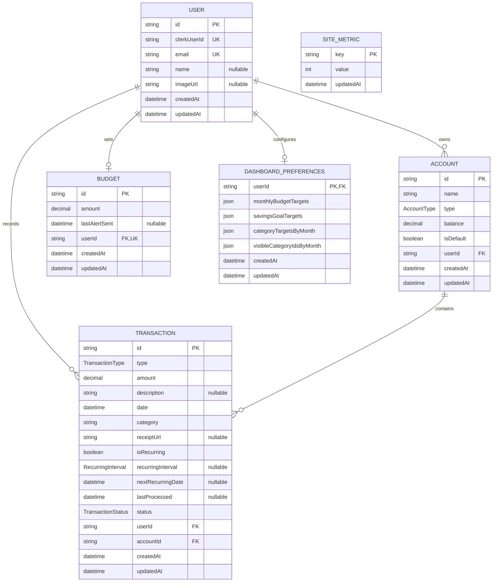
```mermaid
erDiagram
    USER ||--o{ ACCOUNT : owns
    USER ||--o{ TRANSACTION : records
    USER ||--o| BUDGET : sets
    USER ||--o| DASHBOARD_PREFERENCES : configures
    ACCOUNT ||--o{ TRANSACTION : contains

    USER {
        string id PK
        string clerkUserId UK
        string email UK
        string name "nullable"
        string imageUrl "nullable"
        datetime createdAt
        datetime updatedAt
    }

    ACCOUNT {
        string id PK
        string name
        AccountType type
        decimal balance
        boolean isDefault
        string userId FK
        datetime createdAt
        datetime updatedAt
    }

    TRANSACTION {
        string id PK
        TransactionType type
        decimal amount
        string description "nullable"
        datetime date
        string category
        string receiptUrl "nullable"
        boolean isRecurring
        RecurringInterval recurringInterval "nullable"
        datetime nextRecurringDate "nullable"
        datetime lastProcessed "nullable"
        TransactionStatus status
        string userId FK
        string accountId FK
        datetime createdAt
        datetime updatedAt
    }

    BUDGET {
        string id PK
        decimal amount
        datetime lastAlertSent "nullable"
        string userId FK, UK
        datetime createdAt
        datetime updatedAt
    }

    DASHBOARD_PREFERENCES {
        string userId PK, FK
        json monthlyBudgetTargets
        json savingsGoalTargets
        json categoryTargetsByMonth
        json visibleCategoryIdsByMonth
        datetime createdAt
        datetime updatedAt
    }

    SITE_METRIC {
        string key PK
        int value
        datetime updatedAt
    }
```

`DashboardPreferences.userId` is both its primary key and a foreign key to `User`. `Budget.userId` is unique, so a user can have at most one budget record. `SiteMetric` has no user relationship because it stores global counters.

| Enum | Allowed values |
| --- | --- |
| `AccountType` | `CURRENT`, `SAVINGS` |
| `TransactionType` | `INCOME`, `EXPENSE` |
| `TransactionStatus` | `PENDING`, `COMPLETED`, `FAILED` |
| `RecurringInterval` | `DAILY`, `WEEKLY`, `MONTHLY`, `YEARLY` |

Deleting a user cascades to their accounts, transactions, budget, and dashboard preferences. Deleting an account also cascades to its transactions. Database indexes support user transaction history, recurring-transaction processing, and default-account lookup; a partial unique index ensures that each user has at most one default account.

## 🖼️ Screenshots

### Landing Page


### Overview

| Dashboard | Account Summary |
| --- | --- |
|  | 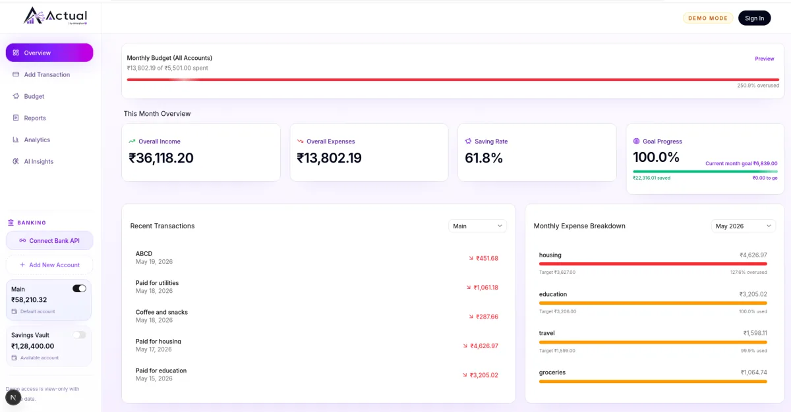 |

### Transactions

| Transaction List | Create Transaction |
| --- | --- |
| 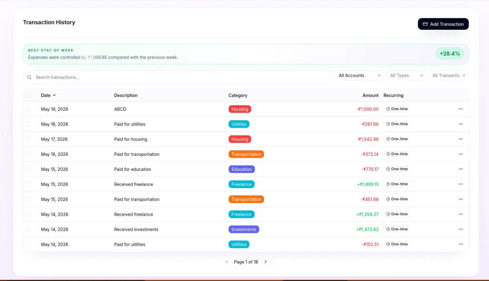 |  |

| Transaction Form |
| --- |
| 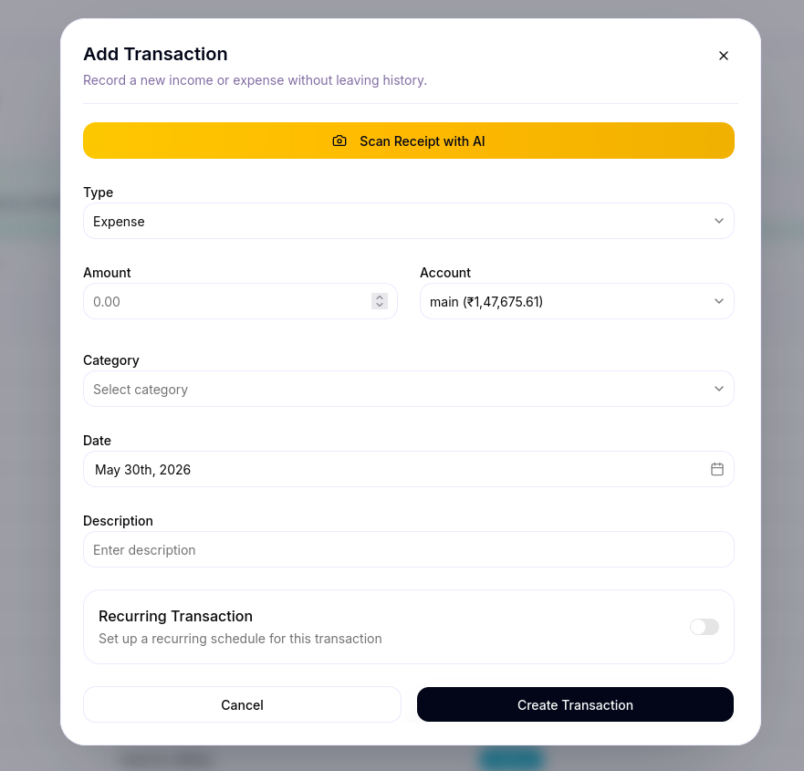 |

### Budgets

| Budget Planning | Category Targets |
| --- | --- |
| 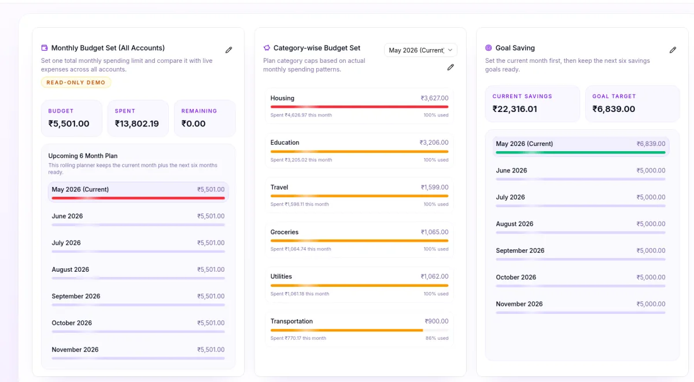 | 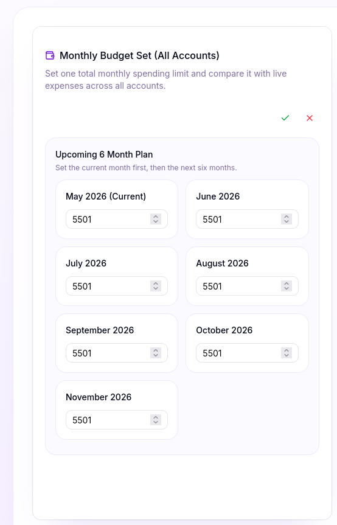 |

| Budget Alert Email |
| --- |
| 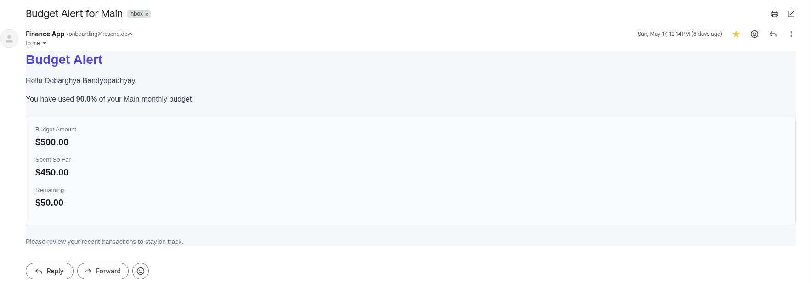 |

### Reports & Analytics

| Reports | Analytics |
| --- | --- |
| 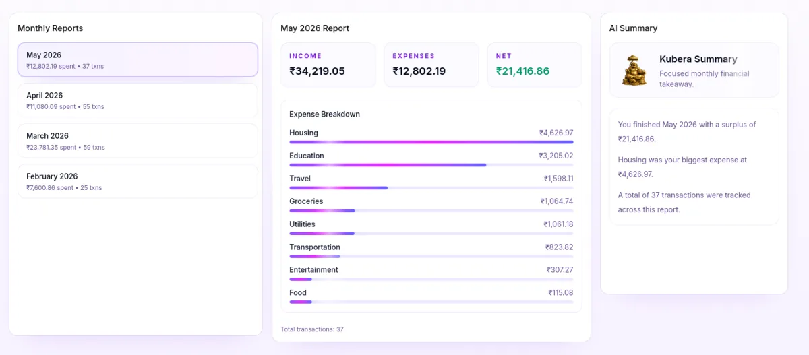 | 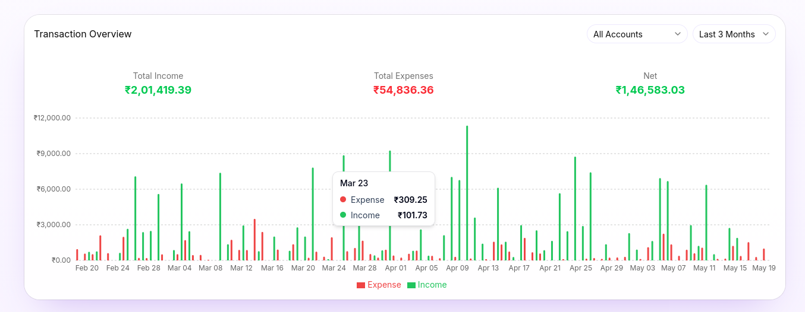 |

| Monthly Report Email |
| --- |
| 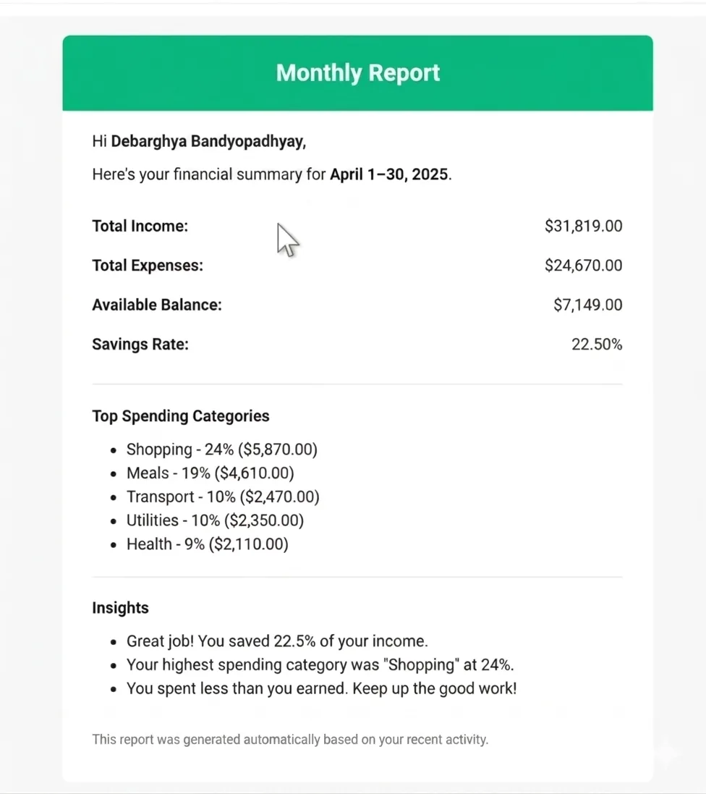 |

### AI Insights

| Kubera AI Assistant | AI Insights |
| --- | --- |
| 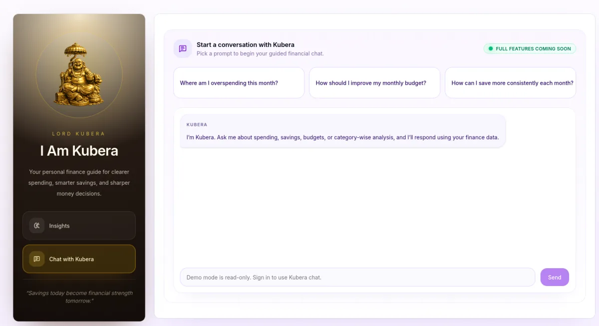 | 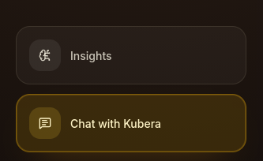 |

## 🛠️ Tech Stack

| Category | Technologies |
| --- | --- |
| Frontend | Next.js, React, TypeScript |
| Styling | Tailwind CSS, shadcn-style UI, Radix UI |
| Authentication | Clerk |
| Database | PostgreSQL, Prisma ORM |
| Background Jobs | Inngest |
| AI / ML | Google Gemini API, Groq Vision API |
| Email | Resend, React Email |
| Charts & Analytics | Recharts |
| Animations | Framer Motion |
| Security | Arcjet rate limiting |
| Icons & UI Feedback | lucide-react, Sonner |

## ⚙️ Installation

1. Clone the repository.

```bash
git clone https://github.com/debarghya131/Actual.git
cd Actual
```

2. Install dependencies.

```bash
npm install
```

3. Set up environment variables.

```bash
cp .env.example .env.local
```

4. Generate Prisma client.

```bash
npx prisma generate
```

5. Run database migrations.

```bash
npx prisma migrate dev
```

6. Start the development server.

```bash
npm run dev
```

## 🔐 Environment Variables

Create a `.env.local` file in the root directory and add the following variables:

```env
DATABASE_URL=
DIRECT_URL=

NEXT_PUBLIC_CLERK_PUBLISHABLE_KEY=
CLERK_SECRET_KEY=
NEXT_PUBLIC_CLERK_SIGN_IN_URL=/sign-in
NEXT_PUBLIC_CLERK_SIGN_UP_URL=/sign-up

ARCJET_KEY=

RESEND_API_KEY=

GEMINI_API_KEY=

GROQ_API_KEY=
GROQ_MODEL=
```

> Never commit real API keys or database credentials to GitHub.

## 🧩 Challenges Faced

- Managing student-style daily expenses in a simple and understandable way
- Keeping account balances accurate after transaction create, update, and delete actions
- Handling recurring transactions without duplicate processing
- Building a useful budget system with monthly and category-wise planning
- Extracting receipt details from images using AI
- Giving personalized AI finance insights without exposing user data publicly
- Protecting authenticated dashboard routes and user-specific data
- Preventing abuse of AI, receipt scanning, and transaction actions
- Sending useful budget alerts and monthly reports automatically
- Keeping the landing page and dashboard visually rich but still lightweight

## ✅ Solutions Implemented

- Built a clean dashboard for income, expenses, savings, budgets, reports, and analytics
- Used Prisma transactions to update transactions and account balances safely
- Added Inngest background jobs for recurring transactions, budget alerts, and monthly reports
- Used Groq Vision API for AI-powered receipt scanning
- Used Gemini API for Kubera AI finance guidance and monthly insights
- Added Clerk authentication and protected routes through `proxy.ts`
- Applied Arcjet rate limiting for sensitive actions like AI chat, receipt scan, account creation, and budget updates
- Stored dashboard preferences in PostgreSQL using Prisma and JSON fields
- Added demo mode so users can explore the app without creating an account
- Compressed large images and replaced heavy PNG assets with optimized WebP files

## 🧪 Testing

- ESLint is configured for code quality checks.
- Server Actions include validation for authentication, required fields, invalid amounts, missing accounts, and invalid recurring transaction data.
- Receipt scanning validates file type and file size before sending images to the AI service.
- Demo mode helps test the main dashboard experience without using real user data.
- Prisma migrations keep the database structure version-controlled and reproducible.

Run linting with:

```bash
npm run lint
```

## ⚡ Optimization

- Large images were compressed and replaced with lightweight WebP assets.
- Heavy dashboard sections use focused components to keep the UI organized.
- Prisma indexes are added for frequently queried fields like `userId`, `accountId`, transaction status, date, and recurring transaction data.
- Server-side data fetching is used for authenticated dashboard pages.
- `Promise.all` is used where multiple independent database queries can run together.
- Prisma client is reused in development to avoid creating too many database connections.
- Background work like recurring transactions, budget alerts, and monthly reports is handled by Inngest instead of blocking user interactions.

## 🔒 Security

- Clerk handles authentication and user session management.
- Protected routes are guarded through `proxy.ts`.
- Database queries are filtered by the authenticated user to prevent cross-user data access.
- Arcjet rate limiting protects sensitive actions such as AI chat, receipt scanning, account creation, transaction creation, and budget updates.
- Environment variables store API keys and database credentials outside the codebase.
- `.env*`, generated files, local tool folders, and build outputs are ignored by Git.
- Receipt uploads are restricted to image files under 5MB.
- Server-side validation is used before creating or updating financial records.

## 🚀 Future Improvements

- Add bank API integration for automatic transaction syncing
- Add CSV import and export for transactions
- Add more advanced AI-based spending predictions
- Add multi-currency support
- Add custom financial goals and goal progress tracking
- Add downloadable PDF reports
- Add more automated tests for Server Actions and financial calculations
- Add PWA support for a better mobile experience
- Add dark mode for the full dashboard
- Add more detailed admin and user activity logs

## 📚 Learnings

- Learned how to build a full-stack finance dashboard with Next.js App Router
- Learned how to design relational database models with Prisma and PostgreSQL
- Learned how to protect user-specific financial data with authentication and server-side checks
- Learned how to manage financial calculations like balances, budgets, savings, and recurring transactions
- Learned how to integrate AI APIs for receipt scanning and finance insights
- Learned how to use background jobs for scheduled reports and alerts
- Learned how to optimize large assets for faster landing page performance
- Learned how to structure a real-world project with reusable components, server actions, and clean folder organization

## 👨‍💻 Author Details


**Debarghya Bandyopadhyay**

## 🤝 Be My Friend

I always like to make new friends. Follow me on:


[](https://portfolio.debarghya.org)


[](https://www.linkedin.com/in/debarghya-bandyopadhyay-953b02400?utm_source=share_via&utm_content=profile&utm_medium=member_android)


[](https://x.com/debarghya131)


[](https://github.com/debarghya131)


[](mailto:debarghyabandyopadhyay191@gmail.com)
